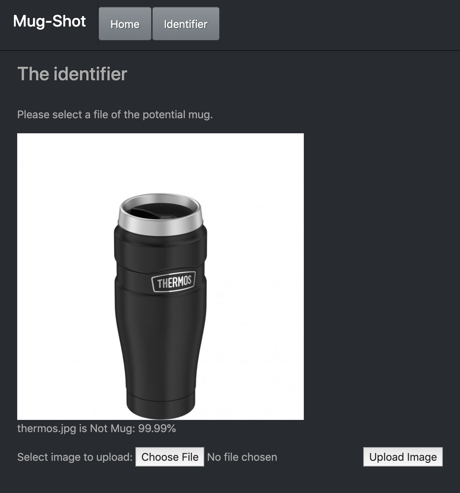

# Mug-Shot

Mug-shot is sort of a passion project. I really wanted to learn more about
machine vision and machine learning so I decided I would devote some time to
building an image recognition model that could recognize mugs/cups. The end goal was
to learn more about image recognition and to hopefully be able to expand this project
to recognize more that just mug in the future.

## How to use:

To use please follow the link to: https://mugshotjm.herokuapp.com/

Or you can pull the from this github repository and download the dependencies listed in the requirements.txt.
Then you could train your own model on your own images.
